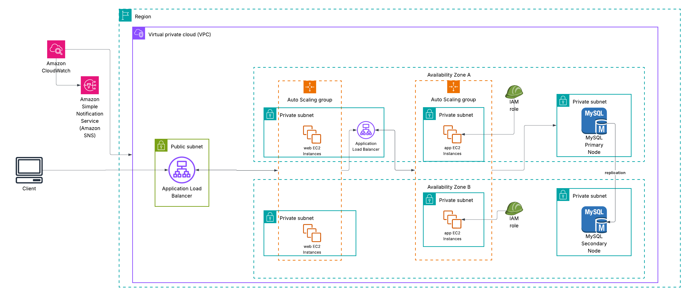

# 🌐 Highly Available and Scalable Web Application on AWS

## 🚀 Project Overview

This project implements a **highly available, fault-tolerant, and scalable web application** architecture on **Amazon Web Services (AWS)**. It demonstrates core cloud computing best practices, specifically focusing on compute scalability using **Amazon EC2**, traffic distribution with **Application Load Balancer (ALB)**, and state management with a **Multi-Availability Zone (Multi-AZ)** relational database (**Amazon RDS for MySQL**).

The architecture is designed to handle fluctuating user loads by automatically scaling resources up and down, ensuring a consistent and resilient user experience while optimizing operational costs.

---

## 🏗️ Architecture Design

The solution is deployed within a single **AWS Region** inside a **Virtual Private Cloud (VPC)**, segmented across **two Availability Zones (AZs)** (AZ A and AZ B) for high availability.

### Architecture Diagram

### Key Components:

* **VPC & Subnets:**
    * **Public Subnets:** Hosts the internet-facing component, the **Application Load Balancer (ALB)**.
    * **Private Subnets (across two AZs):** Hosts the critical application and database components, ensuring they are not directly accessible from the public internet, thereby enhancing security.
* **Application Layer (Web/App EC2 Instances):**
    * **Application Load Balancer (ALB):** Distributes client requests across healthy EC2 instances. It ensures efficient load sharing and operates at Layer 7.
    * **Auto Scaling Groups (ASG):** Manages the EC2 instances (for both web and app tiers) across both AZs. The ASG ensures **Scalability** (auto-scaling based on demand) and **High Availability** (replacing unhealthy instances).
    * **IAM Role:** Assigned to the EC2 instances, granting them necessary permissions to interact with other AWS services (e.g., CloudWatch) without storing access keys.
* **Database Layer (Amazon RDS):**
    * **MySQL Multi-AZ Configuration:** The database is deployed using **Amazon RDS** with a **Primary Node** in AZ A and a synchronously replicated **Secondary Node** (standby replica) in AZ B. This provides automatic failover capabilities for business continuity.
* **Monitoring and Alerting:**
    * **Amazon CloudWatch:** Collects performance metrics and logs from all resources, driving the ASG scaling policies.
    * **Amazon Simple Notification Service (SNS):** Integrated with CloudWatch Alarms to send critical alerts (e.g., high CPU utilization, scaling events) to administrators.

---

## 🔑 Key AWS Services Used

| Service | Purpose in Architecture | Learning Outcome Demonstrated |
| :--- | :--- | :--- |
| **EC2** | Hosts the web and application code. | Secure and scalable instance deployment. |
| **Application Load Balancer (ALB)** | Distributes traffic from the client to the EC2 instances. | Implementation of external load balancing and high availability. |
| **Auto Scaling Group (ASG)** | Automatically manages the number of running EC2 instances. | Optimizing costs and performance using Auto Scaling policies. |
| **Amazon RDS (MySQL)** | Provides a managed, Multi-AZ relational database. | Implementing highly available, managed database services. |
| **IAM** | Provides role-based permissions for EC2 instances. | Securing compute resources using the principle of least privilege. |
| **CloudWatch & SNS** | Monitors resource health and performance; sends critical alerts. | Infrastructure monitoring and automated alerting setup. |

---

## 🛠️ Setup and Deployment Steps

The following steps outline the typical deployment process for this highly available architecture.

### 1. VPC and Networking Setup
1.  **VPC Creation:** Define the network boundary with a suitable CIDR block (e.g., `10.0.0.0/16`).
2.  **Subnet Creation:** Create Public Subnets (for ALB) and Private Subnets (for EC2/RDS) across at least two Availability Zones.
3.  **Internet Connectivity:** Attach an **Internet Gateway (IGW)** to the VPC and deploy a **NAT Gateway** in the Public Subnets to allow outbound internet access for the resources in the Private Subnets.

### 2. Database Deployment (Amazon RDS)
1.  **RDS Subnet Group:** Define a Subnet Group using the dedicated Private Subnets for the database.
2.  **Launch RDS Instance:** Launch a MySQL instance, enabling **Multi-AZ deployment** within the Subnet Group for high availability.

### 3. Compute Layer and Auto Scaling
1.  **IAM Role:** Create an IAM Role with permissions required by EC2 instances (e.g., CloudWatch publishing, RDS connectivity setup) and assign it to the instances.
2.  **EC2 Launch Template:** Create a Launch Template defining the instance configuration (AMI, instance type, Security Group, IAM Role, and User Data script for application installation).
3.  **Auto Scaling Group (ASG):**
    * Create ASGs, referencing the Launch Template.
    * Specify the target **Private Subnets** to ensure multi-AZ distribution.
    * Define **Target Tracking Scaling Policies** (e.g., maintain average CPU Utilization at 50%) to achieve dynamic scaling.

### 4. Load Balancing Configuration
1.  **Target Groups:** Create a Target Group to define instance health checks and register the ASG as its target.
2.  **Application Load Balancer (ALB):**
    * Deploy the ALB in the **Public Subnets**.
    * Configure a Listener (e.g., port 80) to forward incoming traffic to the Target Group.

### 5. Monitoring and Alerting
1.  **SNS Topic:** Create an SNS Topic and subscribe the administrator's email for alerts.
2.  **CloudWatch Alarms:** Create alarms on key ASG and ALB metrics (e.g., Unhealthy Host Count, CPU Utilization thresholds) and configure them to send notifications to the SNS Topic.

---

## 💡 Learning Outcomes Achieved

* Successfully designed and deployed a secure, scalable, and highly available EC2-based web application.
* Implemented **Elastic Load Balancing (ALB)** for robust traffic management.
* Configured **Auto Scaling Groups (ASG)** with dynamic scaling policies to manage compute resources efficiently.
* Established a resilient data layer using **Multi-AZ Amazon RDS** for data durability and high availability.
* Applied **IAM roles** and **VPC private networking** to implement core security controls.